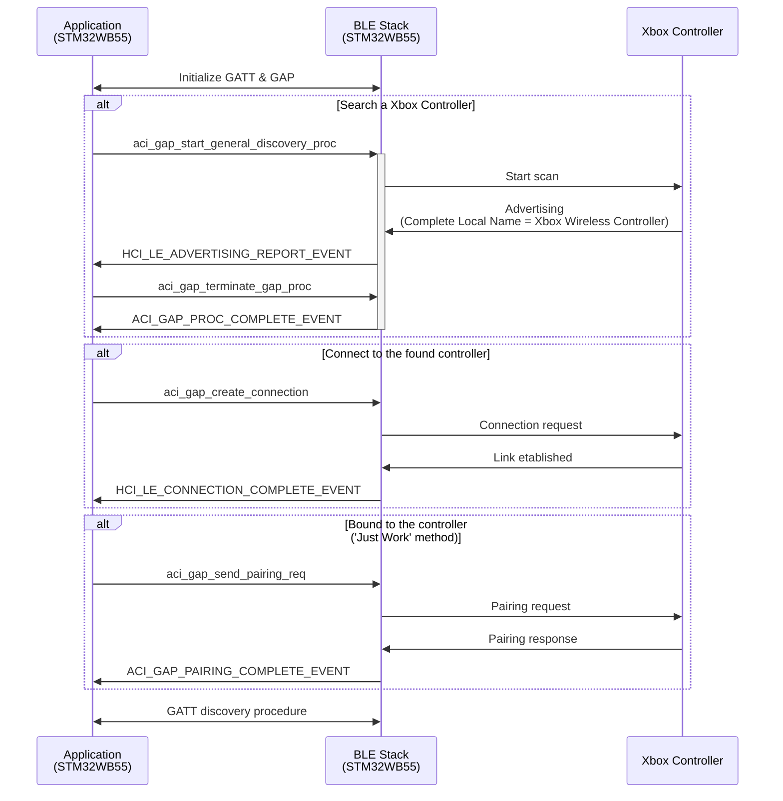
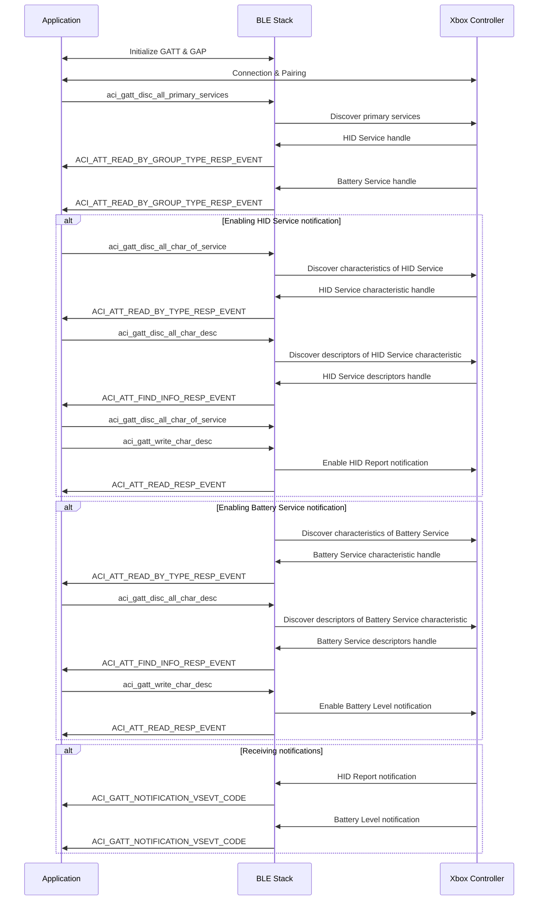

I was looking for a project idea to test my new **NUCLEO-WB55** evaluation board when my eyes landed on a **Xbox controller** lying on my desk. This controller can connect remotely to a device via a proprietary **5 GHz protocol** requiring a USB adapter or by the famous protocol: **BLE (Bluetooth Low Energy)**.
I also remembered having a small unused **OLED display** screen in my stock, originally bought for my **Bus Tracker** project. I thought it could be a nice occasion to also test this screen.

> If you want to learn more about my **Bus Tracker** project, you can read more about it [here]().
{: .prompt-tip }

Those mini-screens reminded me of the cheap mini handheld game consoles which were popular when I was a child.

{: w="200" h="300"}
_Mini handled game console_

Now the goal of my next project was clear: create a similar handheld game console based on a **STM32 microcontroller** with a colorful screen and playable with a wireless **Xbox Controller**!

## Communication with a Xbox Controller

The first goal of this project is to connect the Xbox controller to my **NUCLEO-WB55 board**. The two communicate via **BLE**, but an appropriate **driver** should be written for the microcontroller to realize the connection and parse the controller inputs.

So before starting programming on my board, I need to know how the controller communicates with the Xbox driver on my PC.

To do that I am helped by two software tools:
- **Wireshark** on Windows/Linux, a **network packet analysis software** which can also capture and dissect **BLE packets**
- **nRF Connect** on Android, a generic BLE tool to scan, advertise, and communicate with a device.

### Analyzing BLE packets via Wireshark

By connecting the controller to my PC and intercepting the **BLE packets** between the two devices, I can see all the frames sent by the controller when I realize a specific action (joystick moved, button pressed, trigger pushed, ...).

For example, if I press the button *B*, the controller sends the following frame:

{: w="1000" h="700"}
_BLE packet received when button B is pressed_

The most important part of this packet is the **BLE attribute value**, containing information about all the controller inputs.
So, I filled an **Excel document** with the attribute values intercepted for each performed action and split them by byte. Note that to make it easier to **reverse the protocol**, I only do one action at a time.
This way I am able to identify the purpose of each byte field in the BLE attribute value.
Once all the packets captured, I deduced the following table:

{: w="1000" h="700"}
_Table of packets for each action_

### Writing a Wireshark plugin

To check I didn’t make any mistakes and to better visualize the packets received, I developed a **Wireshark dissector**. Dissectors are meant to analyze some part of a packet’s data and I chose to integrate one into Wireshark via a **plugin**.

I did as follows:
- I **downloaded the Wireshark source code** and installed all the compilation tools
- I **wrote my plugin code in C** by following the [Wireshark documentation on dissectors](https://github.com/wireshark/wireshark/blob/master/doc/README.dissector)
- I **recompiled the application** and the plugin together

The **Xbox controller protocol** is then automatically detected when a BLE packet coming from the controller is received.

{: w="1000" h="700"}
_Wireshark with the Xbox Controller Dissector_

> My **Xbox controller dissector** for Wireshark is available on **GitHub** : [https://github.com/nicopaulb/xbox-wireshark-dissector/tree/main](https://github.com/nicopaulb/xbox-wireshark-dissector/tree/main)
{: .prompt-tip }

### Analyzing BLE profile via nRF Connect

On my phone I launched **nRF Connect** to discover the **BLE services** and **characteristics** defined by the controller. I noticed it had a service called **HID Report** and guessed it was somehow using the **HID protocol** (designed for USB devices) over BLE.

{: w="200" h="200"}
_Xbox Controller on nRF Connect_

After a quick search on internet, I found there is an official **BLE profile** called [**HID over GATT**](https://www.bluetooth.com/specifications/specs/hid-over-gatt-profile-1-0/).

#### HID Protocol

The **Human Interface Device (HID) protocol** is a standard used by USB devices like keyboards, mice, game controllers, and touchscreens to communicate with an host system efficiently. This way the host operating system can include a built-in and standardized **HID driver** able to interpret any input devices.

During the device enumeration phase, a **HID descriptor** containing informations about the type of device and features (number of buttons, axes, keystrokes, ...) is sent to the host. Also a **report descriptor** describing the format of data packets (**reports**) and how they should be interpreted can be asked by the host.

The **HID host** determines how often the device should send data by periodically polling the device at a fixed interval for **input reports** (key presses, mouse movement, ...). The device can also receive **output reports** from the host to, for example, set LED indicators on a keyboard or enable controller rumble.

#### HOG (HID over GATT)

The **HID over GATT profile** is a way to use the HID protocol over BLE. It is based on **GATT (Generic Attribute Profile)** and defines an **HID service** with **characteristics** which are in turn based on the **HID descriptors**.

This service has the necessary characteristics and descriptors to emit **notifications** whenever a controller button is pressed/unpressed.

## STM32WB55 programming

### STM32CubeIDE

I kicked things off with **STM32CubeIDE** (eclipse based IDE). The nice part is that it doesn't just provide a standard IDE (editor + debugger), but also includes **CubeMX**, the graphical code generator.

I quickly set up the required **peripherals** (clocks, debug UART, GPIOs, SPI and BLE), generated a clean baseline, and from there, I developed the application step by step, layering new functionality on top of that base.

### Architecture

{: w="400" h="400"}
_STM32WB55 Software Architecture_

The software is divided in multiple layers of abstraction. I chose to show only the parts of the **STM32 software stack** that are actually used in this project:
- **Hardware**: At the base, the system runs on an **STM32 Nucleo development board** featuring the **STM32WB55RG** microcontroller. This chip integrates both an **ARM Cortex-M4** for application code and a **Cortex-M0+** dedicated to managing the Bluetooth Low Energy (BLE) radio.
- **Drivers**: On top of the hardware sits the **Hardware Abstraction Layer (HAL)**, which provides a standardized API to configure and interact with the **MCU’s peripherals** (GPIOs, SPI, timers, etc.).
- **Middleware**: The middleware layer handles more complex system services. The **STM32 WPAN** is the wireless protocol stack that manages BLE communication and the **STM32 Sequencer** is a lightweight **task scheduler** that simplifies **event-driven programming**.
- **Application**: At the top sits my application, composed of:
  - **BLE HID Host**: the module responsible for **connecting to the Xbox controller**, managing **pairing**, and parsing **HID reports**.
  - **ST7735 Driver**: the **display driver** used to update the **TFT screen**.
  - **Buzzer API**: the code to **play sound** effect using a piezo buzzer
  - **Mini Console**: the **main logic** of the project, implementing the user interface, menu system, test screen, and games such as Snake.

#### BLE stack

The trickiest part, unsurprisingly, was the **BLE stack**.
ST provides a broad API to manage connections, services, and characteristics. The documentation (notably [AN5270](https://www.st.com/resource/en/application_note/an5270-introduction-to-stm32wb-bluetooth-low-energy-wireless-interface-stmicroelectronics.pdf)) and example projects (notably BLE_P2PClient) were really useful here.

I implemented a **state machine** to handle the various **asynchronous BLE events**.
The first step is to initialize the **GAP and GATT** protocols by calling all the necessary APIs. From there, multiple steps are required before the Xbox controller can be successfully paired.
Most of these steps are summarized in the sequence diagram below:


<p style="color:#6d6c6c;font-size: 80%;text-align:center;">Connection and pairing sequence diagram</p>

To simplify, we can define three main states:
- **Scanning**: start a BLE scan to listen for **advertising packets**. The goal is to detect the Xbox controller by checking its **Complete Local Name**, available in its scan response. If the controller is not found (because it iss out of range or powered off), scanning restarts until it is detected.
- **Connection**: establish a **link** to the detected device.
- **Pairing**: pair using the **Just Works** method. This means the pairing process uses the legacy protocol with no secure mode, and MITM (Man-In-The-Middle) protection disabled. Since the controller provides no input capability (no keypad, display, or button for confirmation), it is impossible to use passcodes or keypress authentication.

Once paired, a second state machine takes over to discover the required **GATT services** and enable notifications (battery level, input reports, etc.), which allow the device to receive **HID reports** and **battery level**.


<p style="color:#6d6c6c;font-size: 80%;text-align:center;">GATT discovery sequence diagram</p>


This layered structure makes it much easier to follow the BLE link lifecycle and to gracefully handle events such as disconnections or timeouts.

To make handling HID data easier, I defined a `HID_Report_t` structure based on the Wireshark Xbox Controller dissector made previously. This structure provides direct access to every button, joystick, and trigger value.

```c
typedef struct __attribute__((packed))
{
  uint16_t JOY_LeftAxisX;                       // Left Joystick X, Value = 0 to 65535
  uint16_t JOY_LeftAxisY;                       // Left Joystick Y, Value = 0 to 65535
  uint16_t JOY_RightAxisX;                      // Right Joystick X, Value = 0 to 65535
  uint16_t JOY_RightAxisY;                     	// Right Joystick Y, Value = 0 to 65535
  uint16_t TRG_Left : 10;                       // Left Trigger, Value = 0 to 1023
  uint8_t  : 6;
  uint16_t TRG_Right : 10;                      // Right Trigger, Value = 0 to 1023
  uint8_t  : 6;
  uint8_t  HAT_Switch : 4;                      // Hat switch, Value = 1 to 8, Physical = (Value - 1) x 45 in degrees
#define HATSWITCH_NONE          0x00
#define HATSWITCH_UP            0x01
#define HATSWITCH_UPRIGHT       0x02
#define HATSWITCH_RIGHT         0x03
#define HATSWITCH_DOWNRIGHT     0x04
#define HATSWITCH_DOWN          0x05
#define HATSWITCH_DOWNLEFT      0x06
#define HATSWITCH_LEFT          0x07
#define HATSWITCH_UPLEFT        0x08
  uint8_t  : 4;
  uint8_t  BTN_A : 1;
  uint8_t  BTN_B : 1;
  uint8_t  BTN_RightJoystick : 1;
  uint8_t  BTN_X : 1;
  uint8_t  BTN_Y : 1;
  uint8_t  BTN_BackLeft : 1;
  uint8_t  BTN_BackRight : 1;
  uint8_t  : 2;
  uint8_t  BTN_View : 1;
  uint8_t  BTN_Menu : 1;
  uint8_t  BTN_Xbox : 1;
  uint8_t  BTN_LeftJoystick : 1;
  uint8_t  : 2;
  uint8_t  BTN_Profile : 1;
  uint8_t  : 7;
} HID_Report_t;
```

It is updated with each new **BLE report event** received from the controller (whenever a button is pressed or released).

#### TFT ST7735 Display Driver

The display is driven over **SPI** at 16 MHz, using the **STM32 HAL SPI API** in blocking mode. At this speed, refreshing a 160×128 pixel screen is fast enough that SPI never becomes a bottleneck in the software.

During initialization, the ST7735 registers are configured to operate in landscape mode, which adjusts the X and Y axes for memory access, and the display is set to 16-bit color mode.
Before transmitting pixel data, an address window must be defined so the display knows exactly which region of the screen to update. This avoids having to refresh the entire framebuffer every time a single pixel or small area changes.

Functions to draw a single **pixel**, whole **rectangle**, **text**, or an **image** is available.

Here is a snippet of the `ST7735_FillRectangle` :
```c
void ST7735_FillRectangle(uint16_t x, uint16_t y, uint16_t w, uint16_t h, uint16_t color)
{
	uint16_t line[ST7735_WIDTH] = {0};
	uint8_t pixel[] = { color >> 8, color & 0xFF };

	if((x >= ST7735_WIDTH) || (y >= ST7735_HEIGHT)) return;
	if((x + w - 1) >= ST7735_WIDTH) w = ST7735_WIDTH - x;
	if((y + h - 1) >= ST7735_HEIGHT) h = ST7735_HEIGHT - y;

	ST7735_SELECT();
	ST7735_SetAddressWindow(x, y, x+w-1, y+h-1);

	for(x = 0; x < w; ++x)
		memcpy(line + x, pixel, sizeof(pixel));

	HAL_GPIO_WritePin(ST7735_DC_GPIO_Port, ST7735_DC_Pin, GPIO_PIN_SET);
	for(y = h; y > 0; y--)
		HAL_SPI_Transmit(&ST7735_SPI_PORT, (uint8_t*) line, w * sizeof(pixel), HAL_MAX_DELAY);

	ST7735_UNSELECT();
}
```

> All related code is implemented in [st7735.c](https://github.com/nicopaulb/Miniconsole/blob/master/Core/Src/Application/st7735.c), which provide the configuration and drawing functions.
{: .prompt-tip }

#### Menu and navigation

**Menu handling** and navigation are implemented through another state machine, where each screen has its own state along with two transitions: **Enter** and **Exit**. All screens features a common header bar that displays the current page name along with the controller’s battery level.

At startup, the display shows the different **connection steps** described earlier in the BLE stack section.

{: w="400" h="400"}
_Connection Screen_

Once in the menu, navigation is done using the arrow keys to move between items, while the *A* button is used to confirm a selection.

{: w="400" h="400"}
_Menu Screen_

#### Testing screen

The first screen I implemented was a **test screen**, designed to verify that communication with the controller was functioning correctly and that the HID report was being properly parsed. It simply displays which buttons are currently pressed on the controller.

{: w="400" h="400"}
_Test Screen_

#### Snake screen

After the test screen, I implemented a simple **Snake game**. I chose Snake for a few reasons: it’s a very famous game that almost everyone recognizes, and its mechanics are relatively simple to implement. The game logic doesn’t require complex physics or graphics, which makes it ideal for a first game.

Snake also provides a practical way to test the controller input in a dynamic scenario: arrow keys, joysticks or A/X/Y/B buttons from the Xbox controller can be mapped directly to the snake’s movement, allowing me to validate that the **HID reports** are parsed and processed correctly while updating the display in real time.

{: w="400" h="400"}
_Snake Screen_

The game is structured around a **grid-based system**, where the screen is divided into **cells** (5×5 pixels each) and the snake occupies a sequence of these cells. The display area for the game is centered on the screen, with a small border to visually frame the playing field.

The screen follows the usual **Enter → Current → Exit** pattern of the application state machine.

{: w="400" h="400"}
_Snake Game Flow_

In the Current state, the main game loop runs every `BASE_TICK_TIME` (default 200 ms). Each tick performs several key operations:
- **Player input**: Arrow keys, joystick axes, or buttons (A/B/X/Y) from the Xbox controller are interpreted via the HID report to determine the snake’s direction. The system prevents the snake from reversing into itself.
- **Collision detection**: If the snake collides with a wall or itself, a Game Over screen is displayed and the round ends. The player is prompted to press B to play again.
- **Movement update**: If no collision occurs, the tail of the snake is removed and a new head is drawn in the chosen direction.
- **Food spawning**: If the snake eats the food, a new one is spawned randomly in an empty cell, and the snake’s body length increases.

Here a snippet of the main game loop :

```c
void Stage_Snake_Handle(HID_Report_t *report, uint8_t battery) {
	if (report->BTN_B && !round_running) {
		start_round();
	}

	if (report->BTN_Xbox) {
		round_running = false;
		App_Set_Stage(STAGE_SNAKE_EXIT);
	}

	if (round_running) {
		static long long last_tick = 0;
		long long cur_tick = HAL_GetTick();
		coord_t dir = get_direction(report);

		if (cur_tick - last_tick > BASE_TICK_TIME) {
			last_tick = cur_tick;
			coord_t new_head = { head.x + dir.x, head.y + dir.y };
			// Check for collision
			if (is_wall_collided(&new_head) || is_body_collided(&new_head)) {
				end_round();
			} else {
				move_snake(&new_head);
			}
		}
	}
}
```

The entire game area is tracked in a **grid array**, where each cell can be **empty**, occupied by the **snake**, or contain **food**. The head and tail are tracked separately, which simplifies updates.

However, finding the **new tail position** after each tick requires an additional mechanism. To solve this, every snake body cell is assigned a number that increases at each tick. The oldest cell (the tail) has the smallest number, while the head always has the largest. To find the new tail, the system simply looks for the adjacent cell with the number +1, making tail updates both reliable and efficient.

{: w="400" h="400"}
_Tail-Finding Mechanism_

Also to **optimize performance** and ensure smooth updates, only the tail, head, and food cells are redrawn using small rectangles, rather than refreshing the entire display.

{: w="400" h="400"}
_Snake Game Over Screen_

> The Snake logic is implemented in [stage_snake.c](https://github.com/nicopaulb/Miniconsole/blob/master/Core/Src/Application/stage_snake.c)
{: .prompt-tip }

A quick demo is available here : 



#### Playing sound

To complement the display, I added basic **sound feedback** using a **passive buzzer** connected to the microcontroller. The buzzer is controlled via a **PWM signal** generated by one of the **STM32 timers**, allowing simple tones to be produced at different frequencies.

To keep playback non-blocking, a second **STM32 timers** takes care of timing each note. It updates the PWM frequency after the desired duration, letting the buzzer play short jingles or feedback sounds without holding up the main application.

The core of the buzzer logic is the `Buzzer_Play_Tone` in `buzzer.c` function that sets up the PWM frequency (for pitch) and a second timer (for duration). When called, it configures the timers and starts them:

```c
static void Buzzer_Play_Tone(uint16_t frequency, uint16_t duration) {
	__HAL_TIM_SET_COUNTER(&BUZZER_TIM2_HANDLE, duration);

	if (frequency != 0) {
		__HAL_TIM_SET_PRESCALER(&BUZZER_TIM_HANDLE, TIMR_PRS(frequency));
		HAL_TIM_PWM_Start(&BUZZER_TIM_HANDLE, TIM_CHANNEL_1);
	}

	__HAL_TIM_ENABLE_IT(&BUZZER_TIM2_HANDLE, TIM_IT_UPDATE);
	__HAL_TIM_ENABLE(&BUZZER_TIM2_HANDLE);
}
```

When the duration timer (**TIM2**) expires, it raises an interrupt. Inside the callback, the PWM is stopped and, if more tones are queued, the next one is started automatically:

```c
void HAL_TIM_PeriodElapsedCallback(TIM_HandleTypeDef *htim) {
	if (htim->Instance == TIM2) {
		HAL_TIM_PWM_Stop(&BUZZER_TIM_HANDLE, TIM_CHANNEL_1);
		tone_id++;
		if (tone_id < tone_buf.size) {
			Buzzer_Play_Tone(tone_buf.frequency[tone_id], tone_buf.duration[tone_id]);
		}
	}
}
```

Each melody is represented by two parallel arrays: one holding the frequencies (in hertz) and the other the durations (in milliseconds). This makes it straightforward to describe short jingles or sound effects in a compact form.

For example, the boot-up jingle is defined as:
```c
static const uint16_t boot_freqs[] = { 523, 659, 784, 1047 };
static const uint16_t boot_durations[] = { 150, 150, 150, 300 };
```

Here, the buzzer plays a rising sequence of notes (C5 → E5 → G5 → C6), with each note lasting between 150 and 300 milliseconds.

> The Buzzer logic is implemented in [buzzer.c](https://github.com/nicopaulb/Miniconsole/blob/master/Core/Src/Application/buzzer.c)
{: .prompt-tip }

Sound is used at key moments to make the interface more engaging:
  - **Short melody** on startup
  - **Beeps** when navigating through the menu
  - **Sound effects** during gameplay (for example, when the snake eats food or when a game-over occurs)

Even with such a simple component, this adds an extra layer of **interactivity** to the project and makes it feel much closer to a real console.

## PCB

For this project, I chose to only design a Nucleo-WB55 **hat**, featuring the TFT display and a passive buzzer. This custom board is convenient for **prototyping** since it can be directly plugged into the Nucleo-WB55 development board.

### Layout

The PCB was designed using **Fusion 360** (formerly Eagle), where I created the necessary component **schematics** and **footprints**. 

{: w="400" h="400"}
_Schematic_

From there, I completed the **PCB layout** and **routed** the connections, ensuring compact placement of the screen and buzzer.

{: w="400" h="400"}
_PCB layout_

The final design was manufactured through **JLCPCB**.

{: w="400" h="400"}
_PCB Photo_

Once the PCB arrived, I soldered the required components:
 - Male header pins
 - ST7735 TFT display
 - Passive buzzer

After soldering, the hat was mounted directly on top of the **Nucleo-WB55 board**. This made the setup modular, allowing quick iteration during software development while keeping the hardware tidy and reliable.

{: w="400" h="400"}
_PCB mounted on the Nucleo_

## Future improvement

While the current prototype already delivers a functional mini console, there are several ideas for future enhancements:
  - **New games**: expand beyond Snake with different and more complex titles
  - **Controller rumble support**: use the Xbox controller’s vibration motors to provide haptic feedback
  - **Custom enclosure**: design and 3D-print a case to make the console more durable and visually polished.
