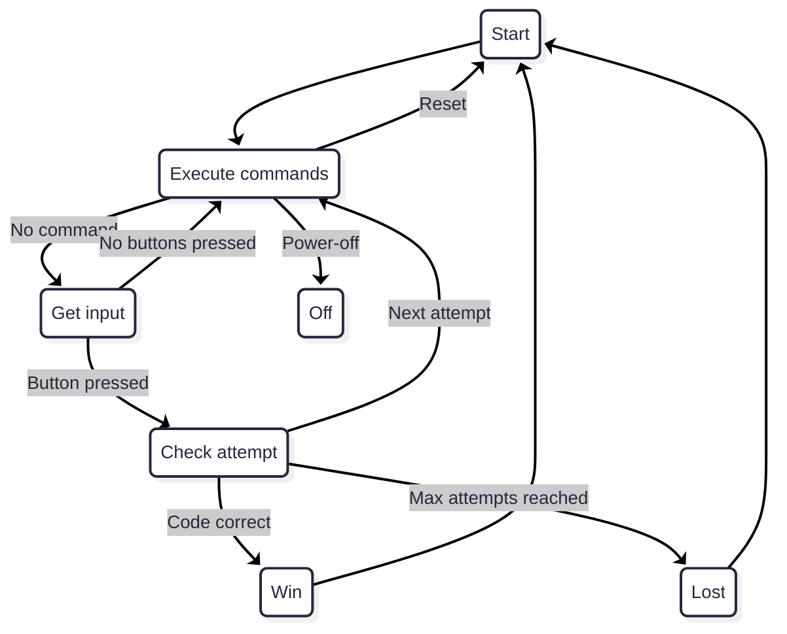

Playing **Mastermind** with my sister this summer gave me the idea to recreate an **electronic version** of the game, one that you could play alone without needing a second player.

This project was also the perfect opportunity to explore a few new things:
- Writing embedded firmware in **C++** instead of **C**.
- Experimenting with **Nordic Semiconductor nRF52DK** development board.
- Learning the **Zephyr RTOS** via the **nRF Connect SDK**.
- Using **Bluetooth Low Energy (BLE)** to connect the device to a **Flutter mobile companion app**, allowing you to configure the game and view your previous attempts.

## Mastermind board game

For those unfamiliar with it, **Mastermind** is a classic logic-based code-breaking game for two players. One player secretly chooses a sequence of colored pegs, while the other must deduce the exact combination in as few attempts as possible. After each guess, the code-maker provides clues using small colored pins: a black pin indicates that a color is both correct and in the right position, while a white pin means that a color is correct but placed incorrectly.

{: w="300"}
_Mastermind board game_

In this project, I implemented a simplified version of the game with a four-color code chosen from six possible colors. The player must guess the correct sequence, and after each attempt, feedback LEDs indicate how many colors are correctly placed and how many are correct but misplaced.

## Hardware

### nRF52 family boards

The **nRF52DK** (based on the **nRF52832**) had been sitting on my desk for months, waiting for a good project.
Nordic is well-known for its **BLE chips**, and this board is perfect for experimenting with a **Zephyr-based** application.

{: w="300"}
_nrf52DK Development Kit_

The development board comes with onboard LEDs, buttons, and easy access to GPIO pins, ideal for prototyping before moving to a custom PCB.
Programming and debugging are handled via the onboard **Segger J-Link**, which makes flashing and serial debugging effortless.

### LED strip

To display both the **4-color code** and the **4 feedback clues**, we need 8 RGB LEDs.
To minimize wiring complexity, I reused a **WS281B LED strip** from my previous **Ambilight project**.

> If you want to learn more about my **Ambilight** project, you can read more about it [here]().
{: .prompt-tip }

{: w="150"}
_LED Strip with WS281B controller_

The WS281B uses a **one-wire communication protocol**, where data is transmitted in a strict timing-based sequence of high and low pulses to represent bits. Each LED extracts its portion of the data and forwards the rest downstream, making it possible to control the entire strip with a single GPIO pin.

For integration, the strip was cut into **two groups of four LEDs** (code + clues) but kept connected on the same data line. Header pins were soldered directly to the pads for direct connection to the microcontroller.

### Buttons

To input colors for each guess, I opted for **one button per color** rather than cycling through options with a single button or encoder.
This approach makes the game much more intuitive and provides immediate visual feedback.

Each button corresponds to one of the six available colors.

{: w="150"}
_Colored Buttons_

### 7-segments display

A **dual-digit 7-segment display** is used to show the number of guesses made so far.
This makes it easy to track progress during the game.

{: w="100"}
_Dual-digit 7-segment display_

The display is controlled by a **74HC595 shift register**, which reduces GPIO usage by handling all segment outputs through a serial interface (SPI).  This also makes it easy to daisy-chain more displays if needed.

### Piezo buzzer

A small **passive piezo buzzer** adds sound feedback for player actions : button presses, valid guesses, or when the game ends.
The buzzer is driven by a PWM signal to generate simple tones directly from the MCU.

## Software

> The full project source code is available on GitHub : [https://github.com/nicopaulb/mastermind](https://github.com/nicopaulb/mastermind)
{: .prompt-info }

### Zephyr

[Zephyr](https://zephyrproject.org/) is an open-source **real-time operating system (RTOS)** designed for embedded devices.

{: w="100" h="100"}
_Zephyr_

Its main strength lies in its clean hardware abstraction: using **Devicetree** and **Kconfig**, it can easily describe hardware and configure features without modifying source code.

#### Devicetree

The project includes dedicated **Devicetree overlay files** for both:
- The **nRF52DK** (used for development)
- The **nRF52840** (used in the final PCB prototype)

This ensures the same firmware can be built for both hardware targets without modifying the core application code.

Below is an excerpt from the Devicetree overlay for the nRF52840, which describes the LED strip configuration:

```conf
&spi2 {
	compatible = "nordic,nrf-spim";
	pinctrl-0 = <&spi2_ledstrip>;
	pinctrl-1 = <&spi2_ledstrip_sleep>;

	led_strip: ws2812@0 {
		compatible = "worldsemi,ws2812-spi";

		/* SPI */
		reg = <0>;
		spi-max-frequency = <4000000>;

		/* WS2812 */
		chain-length = <8>;
		color-mapping = <LED_COLOR_ID_GREEN
		LED_COLOR_ID_RED
		LED_COLOR_ID_BLUE>;
		spi-one-frame = <0x70>;
		spi-zero-frame = <0x40>;
	};
};

...

&pinctrl {

  ...

	spi2_ledstrip: spi2_ledstrip {
		group1 {
			psels = <NRF_PSEL(SPIM_SCK, 1, 1)>,
			        <NRF_PSEL(SPIM_MOSI, 1, 0)>,
			        <NRF_PSEL(SPIM_MISO, 1, 7)>;
		};
	};

	spi2_ledstrip_sleep: spi2_ledstrip_sleep {
		group1 {
			psels = <NRF_PSEL(SPIM_SCK, 1, 1)>,
			        <NRF_PSEL(SPIM_MOSI, 1, 0)>,
			        <NRF_PSEL(SPIM_MISO, 1, 7)>;
			low-power-enable;
		};
	};
};
```
{: file="boards/promicro_nrf52840_nrf52840_uf2.overlay" }

The first section adds the LED strip to the `spi2` node, setting various  parameters such as maximum SPI frequency and the number of LEDs in the chain.

The second section defines new `pinctrl` child nodes, specifying which physical pins are assigned to `spi2` for normal operation and for low-power mode.

#### KConfig

To take advantage of the various features offered by Zephyr, they must first be enabled through **KConfig**. This configuration system controls which modules, drivers, and subsystems are included in the firmware build. By selectively enabling only the required features, it ensures that the final image remains lightweight and optimized, avoiding unnecessary code and resource usage.

```ini
# Device
CONFIG_LOG=y
CONFIG_TEST_RANDOM_GENERATOR=y
CONFIG_ENTROPY_GENERATOR=y
CONFIG_STATIC_INIT_GNU=y
CONFIG_POLL=y
CONFIG_SMF=y
CONFIG_POWEROFF=y
CONFIG_SPI=y

# For LED
CONFIG_LED_STRIP=y
CONFIG_LED_STRIP_LOG_LEVEL_DBG=y

# For Bluetooth
CONFIG_BT=y
CONFIG_BT_SMP=y
CONFIG_BT_PERIPHERAL=y
CONFIG_BT_DIS=y
CONFIG_BT_DIS_PNP=n
CONFIG_BT_DEVICE_NAME="Mastermind"
CONFIG_BT_GATT_CLIENT=y
CONFIG_BT_BUF_ACL_RX_SIZE=251
CONFIG_BT_BUF_ACL_TX_SIZE=251
CONFIG_BT_L2CAP_TX_MTU=247
CONFIG_BT_CTLR_DATA_LENGTH_MAX=251

# For Buzzer
CONFIG_PWM=y
CONFIG_PWM_LOG_LEVEL_DBG=y

# For 7 segment display
CONFIG_AUXDISPLAY=y
CONFIG_AUXDISPLAY_74HC595=y
```
{: file="prj.conf" }

### nRF Connect SDK

The Nordic **nRF Connect SDK** is built on top of Zephyr and provides multiples BLE, GPIO, PWM, and I2C drivers.
This allowed me to focus on the application logic and peripheral control rather than writing low-level drivers for common peripheral from scratch.

Installation and setup are greatly simplified thanks to the nRF Connect for VS Code extension. From this interface, you can install and manage the entire SDK, toolchain, and your projects directly within Visual Studio Code. It makes it easy to build, flash, and debug applications.

### C++ for embedded development

Unlike most of my previous embedded projects in pure **C**, this one is written primarily in **C++**.
The goal was to use modern abstractions while still respecting embedded constraints (no heap allocation, deterministic behavior, low memory usage).

To achieve this, I used the **Embedded Template Library (ETL)** : a lightweight alternative to the STL that provides fixed-capacity containers and algorithms designed for microcontrollers.

### Architecture

The application core logic is organized around Zephyr **Finite State Machine (FSM) API**, which provides a clean and modular way to manage the game various states and transitions. Each state corresponds to a distinct phase of the Mastermind game : handling player input, verifying guesses, processing BLE commands or managing power and resets.

This design ensures clear separation of concerns and makes the codebase easier to extend, debug, and maintain.


<p style="color:#6d6c6c;font-size: 80%;text-align:center;">State diagram</p>

### Implementation

Each peripheral (buttons, LED strip, 7-segment display, and BLE) is implemented in its own air of C++ source and header files.

This modular structure improves readability and maintainability by isolating **hardware-specific logic** from the main application flow.

#### Input handling

Each button is configured to trigger a **GPIO interrupt** when pressed, which in turn raises a **signal** handled by the main application. The main thread calls the `button_val wait_for_input(k_timeout_t timeout)` function to wait for user input. This function blocks until the signal is received or until the specified **timeout** expires.

```c++
/**
 * @brief Wait for a button press event with a given timeout.
 *
 * @param timeout The timeout in milliseconds.
 * @return The button value of the pressed button, or BUTTON_VAL_NONE if no event was received.
 */
button_val buttons::wait_for_input(k_timeout_t timeout)
{
	unsigned int signaled;
	int result;
	int index = 0;
	button_val ret = button_val::BUTTON_VAL_NONE;
	struct k_poll_event events[1] = {
		K_POLL_EVENT_INITIALIZER(K_POLL_TYPE_SIGNAL,
								 K_POLL_MODE_NOTIFY_ONLY,
								 &signal),
	};

	k_poll(events, 1, timeout);
	k_poll_signal_check(&signal, &signaled, &result);

	if (signaled)
	{
		for (const auto &i : specs)
		{
			if (BIT(i.pin) == result)
			{
				ret = static_cast<button_val>(index);
				break;
			}
			index++;
		}
	}
	else
	{
		ret = button_val::BUTTON_VAL_NONE;
	}

	k_poll_signal_reset(&signal);
	events[0].state = K_POLL_STATE_NOT_READY;
	return ret;
}
```
{: file="src/buttons.cpp" }

Based on the returned button value, the current **guess array** is updated, and the corresponding LEDs are refreshed to visually reflect the player input.

All buttons share a common debouncing mechanism, implemented in software to filter out mechanical noise and ensure clean, single detections per press. Additionally, a minimal time interval is enforced between inputs to prevent accidental multiple presses or simultaneous button activations.

#### LED Strip driver

For controlling the LED strip, I relied on an existing Zephyr driver compatible with the WS281B controller. This driver handles the precise timing protocol required by the LEDs.

It provides a convenient API, particularly the `led_strip_update_rgb()` function, which updates the entire strip by passing an array of RGB color values. This makes it straightforward to refresh all LEDs simultaneously with minimal effort and ensures reliable color rendering without having to manage timing at the application level.

#### 7-segments display

I wrote a **custom Zephyr driver** for the 7-segment module with a **74HC595** shift register.

The driver implements the Zephyr **AuxDisplay API**, allowing digits to be displayed via simple function calls such as `auxdisplay_write("10")`.

This is the only part of the project written in **C** and not **C++**, since I would like to push this driver to Zephyr official driver catalog.

#### PWM Buzzer

The buzzer is controlled through Zephyr **PWM driver**, which allows precise generation of tones by varying frequency and duration. Each sound effect (menu navigation, color selection, or end-game feedback) is defined as a short sequence of notes.

A dedicated thread (via the **Thread API**) manages the playback, dynamically adjusting the PWM frequency over time to produce complete melodies smoothly and without blocking the main application.

Below is the thread implementation:

```c++
/**
 * @brief Thread function for buzzer.
 *
 * This function is responsible for playing all the notes.
 */
void buzzer::thread(void *object, void *d1, void *d2)
{
    buzzer *buzzer_obj = reinterpret_cast<buzzer *>(object);
    bool restart_now = false;
    k_sem_take(&buzzer_obj->initialized, K_FOREVER);

    while (1)
    {
        restart_now = false;
        for (auto elem : buzzer_obj->song)
        {
            if (elem.note == 0)
            {
                // Silence
                pwm_set_pulse_dt(&buzzer_obj->pwm_buzzer, 0);
            }
            else
            {
                pwm_set_dt(&buzzer_obj->pwm_buzzer, PWM_HZ(elem.note),
                           PWM_HZ((elem.note)) / 2);
            }
            if (k_msleep(elem.duration) > 0)
            {
                // If sleep is interrupted by another song request, immediatly stop the current song and restart the new one
                restart_now = true;
                break;
            };
        }

        pwm_set_pulse_dt(&buzzer_obj->pwm_buzzer, 0);
        if (!restart_now)
        {
            k_sleep(K_FOREVER);
        }
    }
}
```
{: file="src/ble.cpp" }

#### BLE communication

The BLE module exposes a **custom GATT profile** for sharing the game state and configuring the electronic Mastermind device.

{: w="500" h="500" }
_BLE profile_

At the heart of this system lies the **Status service**, which transmits all essential information about the current game state. The data is encoded as a byte string, structured to include the secret code, the number of attempts made, and the list of previous guesses.

The second service, called the **Command service**, allows to send specific instructions to the Mastermind device. Each command is represented by a unique identifier that the firmware interprets to perform the corresponding action.

The supported commands are:
- 0x00 - **Restart game**: resets the current session and starts a new round.
- 0x01 - **Set custom code**: sends a manually defined code to the device, overriding the randomly generated one.
- 0x02 - **Power off**: powers down the board to save energy when the device is not in use. Press any physical buttons to wake up.

### Flutter application

A simple **Flutter application** was developed to interface with the game via Bluetooth Low Energy (BLE).

The app connects to the electronic Mastermind board, retrieves data from its GATT service, reconstruct the full game history in real time and display it to the player. It can also transmit the commands mentionned in the previous part back to the board.

I chose Flutter for this companion app because I already had prior experience with the framework from previous projects, such as the **Gazette**.

> If you want to learn more about my **Gazette** project, you can read about it [here]().
{: .prompt-tip }

To handle BLE communication across all platforms (mobile, desktop, and web) using a unified API, the app relies on the [**flutter_blue_plus**](https://pub.dev/packages/flutter_blue_plus).

The application acts as a BLE central device, scanning for and connecting to the nRF board acting as the BLE peripheral. Once connected, it discovers all available GATT services and characteristics. The user interface is composed of two main screens:
  - A **connection screen** that looks for nearby devices and establishes the BLE link
  - A **game screen** that displays live data and allows the user to send commands

{: w="600" h="600"}
_Application screens_

During the game, players can consult their past attempts to refine their next guesses. Buttons on the interface allow for various interactions, for example, the “Set Code” button opens a popup window where each color can be selected individually to define a custom secret code.

{: w="300" h="600"}
_Application 'Set code' popup_

If the player wants to give up or request a hint, pressing the **'Show Code' button** reveals the correct sequence. When the player either guesses the combination or runs out of attempts, a popup displays the outcome (either a win or lose message) along with the final code.

{: w="300" h="600"}
_Application 'Round lost' popup_

> The Flutter application code is available on GitHub : [https://github.com/nicopaulb/mastermind/tree/master/flutter-app](https://github.com/nicopaulb/mastermind/tree/master/flutter-app).
{: .prompt-tip }

## Integration

For the final version, I decided to use an **nRF52840 board** instead of the **nRF52832** from the development kit.
This choice was mainly driven by the availability of cheap and compact clone boards that already include a USB-C connector, an external clock, and a pre-flashed bootloader.

Thanks to this bootloader, the microcontroller can be programmed by simply enter bootloader mode, connect the board to a computer, and drag and drop the UF2 file onto the mounted USB volume.
Alternatively, the board can also be flashed using an **ST-Link V2 debugger** through the **SWD/SWCLK pins**, though I chose not to route these on the PCB for simplicity.

{: w="600" h="600"}
_Breadboard prototype_

This first prototype was made with breadboard and lot of wires, but I then used **KiCad** to create the schematic and PCB.

### Schematic

{: w="600" h="600"}
_Schema_

Since the nRF52840 module also includes an onboard battery charger, I added a **JST 2-pin connector** to allow a Li-Ion or Li-Po battery to be connected directly, making the device fully portable.

I also added an extra button connected to the nRF52840 reset pin, making it easier to reset the board or enter the bootloader.

### PCB

{: w="600" h="600"}
_PCB Layout_

The PCB was designed in **KiCad** using a compact **two-layer layout** to keep the board cost-effective and simple to assemble. All components are positioned for straightforward routing and easy access to key peripherals like the buttons.

Once again, the board was fabricated by **JLCPCB**, and I handled the assembling myself.

{: w="600" h="600"}
_PCB before assembling_

{: w="600" h="600"}
_Fully assembled PCB_

I also added a few mounting holes in the corners to eventually attach the board to a 3D-printed case.

## Demo


