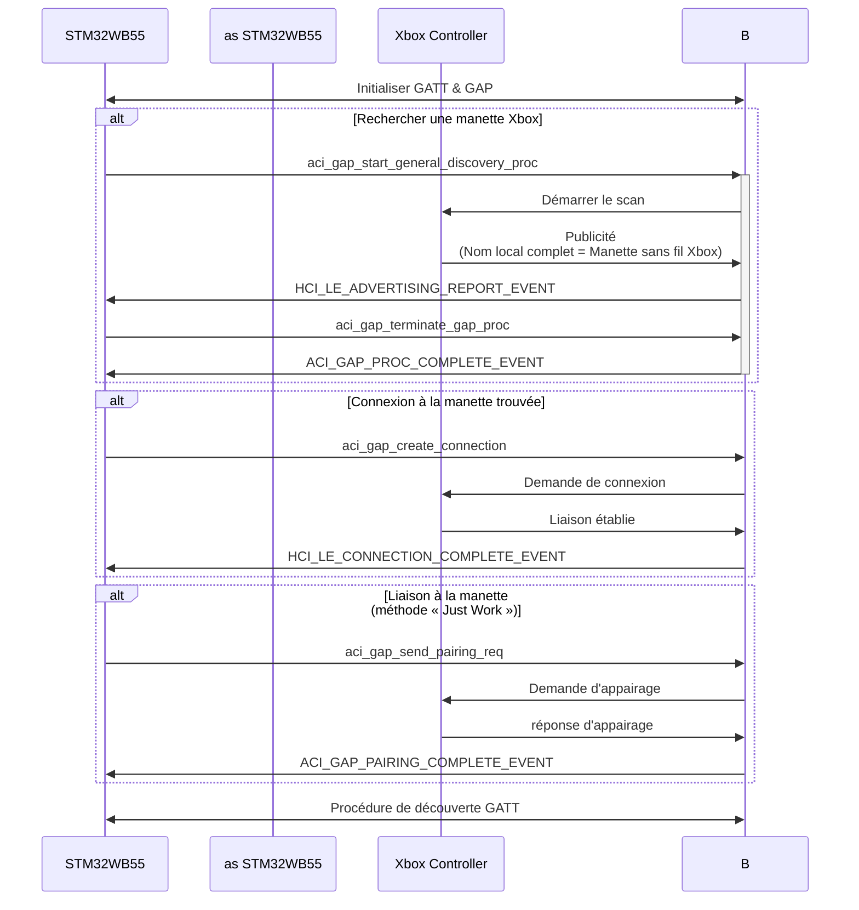
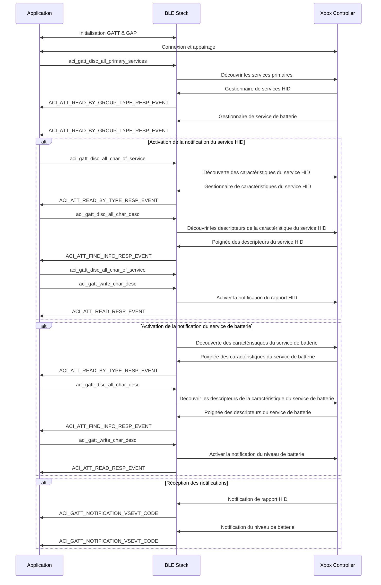

Je cherchais une idée de projet pour tester ma nouvelle carte d'évaluation **NUCLEO-WB55** lorsque mon regard s'est posé sur une **manette Xbox** posée sur mon bureau. Cette manette peut se connecter à distance à un appareil via un **protocole 5 GHz** propriétaire nécessitant un adaptateur USB ou via le célèbre protocole **BLE (Bluetooth Low Energy)**.

Je me suis également souvenu que j'avais dans mon stock un petit écran **OLED** inutilisé, acheté à l'origine pour mon projet **Bus Tracker**. J'ai pensé que ce serait une bonne occasion de tester également cet écran.

> Si vous souhaitez en savoir plus sur mon projet **Bus Tracker**, vous pouvez le découvrir [ici]().
{: .prompt-tip }

Ces mini-écrans me rappellent les mini-consoles de jeux portables bon marché qui étaient populaires quand j'étais enfant.

{: w="200" h="300"}
_Mini console de jeux portable_

L'objectif de mon prochain projet était désormais clair : créer une console de jeux portable similaire basée sur un **microcontrôleur STM32** avec un écran couleur et jouable avec une **manette Xbox** sans fil !

## Communication avec une manette Xbox

Le premier objectif de ce projet est de connecter la manette Xbox à ma **carte NUCLEO-WB55**. Les deux communiquent via **BLE**, mais un **pilote** approprié doit être écrit pour le microcontrôleur afin de réaliser la connexion et d'analyser les entrées de la manette.
Avant de commencer à programmer ma carte, je dois donc savoir comment la manette communique avec le pilote Xbox sur mon PC.

Pour ce faire, je m'aide de deux outils logiciels :
- **Wireshark** sur Windows/Linux, un **logiciel d'analyse de paquets réseau** qui peut également capturer et disséquer les **paquets BLE**
- **nRF Connect** sur Android, un outil BLE générique permettant de scanner, de signaler et de communiquer avec un appareil.

### Analyse des paquets BLE via Wireshark

En connectant le contrôleur à mon PC et en interceptant les **paquets BLE** entre les deux appareils, je peux voir toutes les trames envoyées par le contrôleur lorsque je réalise une action spécifique (joystick déplacé, bouton enfoncé, gâchette actionnée, etc.).

Par exemple, si j'appuie sur le bouton *B*, le contrôleur envoie la trame suivante :

{: w="1000" h="700"}
_Paquet BLE reçu lorsque le bouton B est enfoncé_

La partie la plus importante de ce paquet est la **valeur d'attribut BLE**, qui contient des informations sur toutes les entrées de la manette.

J'ai donc rempli un **document Excel** avec les valeurs d'attribut interceptées pour chaque action effectuée et je les ai divisées par octet. Notez que pour faciliter la **réversibilité du protocole**, je n'effectue qu'une seule action à la fois.
De cette façon, je suis en mesure d'identifier la fonction de chaque champ d'octet dans la valeur d'attribut BLE.
Une fois tous les paquets capturés, j'ai déduit le tableau suivant :

{: w="1000" h="700"}
_Tableau des paquets pour chaque action_

### Écriture d'un plugin Wireshark

Pour vérifier que je n'avais pas fait d'erreur et pour mieux visualiser les paquets reçus, j'ai développé un **dissecteur Wireshark**. Les dissecteurs sont destinés à analyser une partie des données d'un paquet et j'ai choisi d'en intégrer un dans Wireshark via un **plugin**.

J'ai procédé comme suit :
- J'ai **téléchargé le code source de Wireshark** et installé tous les outils de compilation
- J'ai **écrit le code de mon plugin en C** en suivant la [documentation Wireshark sur les dissectors](https://github.com/wireshark/wireshark/blob/master/doc/README.dissector)
- J'ai **recompilé l'application** et le plugin ensemble

Le **protocole du contrôleur Xbox** est alors automatiquement détecté lorsqu'un paquet BLE provenant du contrôleur est reçu.

{: w="1000" h="700"}
_Wireshark avec le dissecteur du contrôleur Xbox_

> Mon **dissecteur de manette Xbox** pour Wireshark est disponible sur **GitHub** : [https://github.com/nicopaulb/xbox-wireshark-dissector/tree/main](https://github.com/nicopaulb/xbox-wireshark-dissector/tree/main)
{: .prompt-tip }

### Analyse du profil BLE via nRF Connect

Sur mon téléphone, j'ai lancé **nRF Connect** pour découvrir les **services BLE** et les **caractéristiques** définis par la manette. J'ai remarqué qu'elle disposait d'un service appelé **HID Report** et j'ai supposé qu'elle utilisait d'une manière ou d'une autre le **protocole HID** (conçu pour les périphériques USB) via BLE.

{: w="200" h="200"}
_Manette Xbox sur nRF Connect_

Après une rapide recherche sur Internet, j'ai découvert qu'il existait un **profil BLE** officiel appelé [**HID over GATT**](https://www.bluetooth.com/specifications/specs/hid-over-gatt-profile-1-0/).

#### Protocole HID

Le **protocole HID (Human Interface Device)** est une norme utilisée par les périphériques USB tels que les claviers, les souris, les manettes de jeu et les écrans tactiles pour communiquer efficacement avec un système hôte. De cette façon, le système d'exploitation hôte peut inclure un **pilote HID** intégré et standardisé capable d'interpréter n'importe quel périphérique d'entrée.

Pendant la phase d'énumération des périphériques, un **descripteur HID** contenant des informations sur le type de périphérique et ses caractéristiques (nombre de boutons, axes, frappes, etc.) est envoyé à l'hôte. L'hôte peut également demander un **descripteur de rapport** décrivant le format des paquets de données (**rapports**) et la manière dont ils doivent être interprétés.

L'**hôte HID** détermine la fréquence à laquelle le périphérique doit envoyer des données en interrogeant périodiquement le périphérique à intervalles fixes pour obtenir des **rapports d'entrée** (pressions sur les touches, mouvements de la souris, etc.). Le périphérique peut également recevoir des **rapports de sortie** de l'hôte afin, par exemple, de régler les voyants LED d'un clavier ou d'activer la vibration du contrôleur.

#### HOG (HID over GATT)

Le **profil HID over GATT** permet d'utiliser le protocole HID sur BLE. Il est basé sur le **GATT (Generic Attribute Profile)** et définit un **service HID** avec des **caractéristiques** qui sont elles-mêmes basées sur les **descripteurs HID**.

Ce service dispose des caractéristiques et des descripteurs nécessaires pour émettre des **notifications** chaque fois qu'un bouton du contrôleur est enfoncé/relâché.

## Programmation STM32WB55

### STM32CubeIDE

J'ai commencé avec **STM32CubeIDE** (IDE basé sur Eclipse). L'avantage est qu'il ne fournit pas seulement un IDE standard (éditeur + débogueur), mais inclut également **CubeMX**, le générateur de code graphique.

J'ai rapidement configuré les **périphériques** requis (horloges, UART de débogage, GPIO, SPI et BLE), généré une base de référence propre, puis développé l'application étape par étape, en ajoutant de nouvelles fonctionnalités à cette base.

### Architecture

{: w="400" h="400"}
_Architecture logicielle STM32WB55_

Le logiciel est divisé en plusieurs couches d'abstraction. J'ai choisi de ne montrer que les parties de la **pile logicielle STM32** qui sont réellement utilisées dans ce projet :
- **Hardware** : à la base, le système fonctionne sur une **carte de développement STM32 Nucleo** équipée du microcontrôleur **STM32WB55RG**. Cette puce intègre à la fois un **ARM Cortex-M4** pour le code d'application et un **Cortex-M0+** dédié à la gestion de la radio Bluetooth Low Energy (BLE).
- **Drivers** : Au-dessus du matériel se trouve la **couche d'abstraction matérielle (HAL)**, qui fournit une API standardisée pour configurer et interagir avec les **périphériques du microcontrôleur** (GPIO, SPI, temporisateurs, etc.).
- **Middleware** : La couche middleware gère les services système plus complexes. Le **STM32 WPAN** est la pile de protocoles sans fil qui gère la communication BLE et le **STM32 Sequencer** est un **planificateur de tâches** léger qui simplifie la **programmation événementielle**.
- **Application** : Au sommet se trouve mon application, composée de :
  - **BLE HID Host** : le module responsable de la **connexion à la manette Xbox**, de la gestion du **couplage** et de l'analyse des **rapports HID**.
  - **ST7735 Driver** : le **pilote d'affichage** utilisé pour mettre à jour l'**écran TFT**.
  - **API Buzzer** : le code permettant de **jouer des effets sonores** à l'aide d'un buzzer piézoélectrique
  - **Mini Console** : la **logique principale** du projet, qui implémente l'interface utilisateur, le système de menus, l'écran de test et les jeux tels que Snake.

#### BLE stack

Sans surprise, la partie la plus délicate a été la **stack BLE**.
ST fournit une API complète pour gérer les connexions, les services et les caractéristiques. La documentation (notamment [AN5270](https://www.st.com/resource/en/application_note/an5270-introduction-to-stm32wb-bluetooth-low-energy-wireless-interface-stmicroelectronics.pdf)) et les exemples de projets (notamment BLE_P2PClient) ont été très utiles à cet égard.

J'ai implémenté une **machine à états** pour gérer les différents **événements BLE asynchrones**.
La première étape consiste à initialiser les protocoles **GAP et GATT** en appelant toutes les API nécessaires. À partir de là, plusieurs étapes sont nécessaires avant que la manette Xbox puisse être appairée avec succès.

La plupart de ces étapes sont résumées dans le diagramme de séquence ci-dessous :



<p style="color:#6d6c6c;font-size: 80%;text-align:center;">Diagramme de séquence de connexion et d'appairage</p>

Pour simplifier, nous pouvons définir trois états principaux :
- **Analyse** : lancer une analyse BLE pour écouter les **paquets publicitaires**. L'objectif est de détecter la manette Xbox en vérifiant son **nom local complet**, disponible dans sa réponse d'analyse. Si la manette n'est pas trouvée (parce qu'elle est hors de portée ou éteinte), l'analyse redémarre jusqu'à ce qu'elle soit détectée.
- **Connexion** : établir une **liaison** avec l'appareil détecté.
- **Appairage** : appairer à l'aide de la méthode **Just Works**. Cela signifie que le processus d'appairage utilise le protocole hérité sans mode sécurisé et que la protection MITM (Man-In-The-Middle) est désactivée. Étant donné que la manette ne dispose d'aucune capacité de saisie (pas de clavier, d'écran ou de bouton de confirmation), il est impossible d'utiliser des codes d'accès ou une authentification par pression de touche.

Une fois l'appairage effectué, une deuxième machine à états prend le relais pour découvrir les **services GATT** requis et activer les notifications (niveau de batterie, rapports d'entrée, etc.), ce qui permet à l'appareil de recevoir des **rapports HID** et le **niveau de batterie**.


<p style="color:#6d6c6c;font-size: 80%;text-align:center;">Diagramme de séquence de découverte GATT</p>

Cette structure en couches facilite considérablement le suivi du cycle de vie de la liaison BLE et permet de gérer avec élégance les événements tels que les déconnexions ou les délais d'attente.

Pour faciliter la gestion des données HID, j'ai défini une structure `HID_Report_t` basée sur le dissecteur Wireshark Xbox Controller créé précédemment. Cette structure permet d'accéder directement à toutes les valeurs des boutons, manettes et gâchettes.

```c
typedef struct __attribute__((packed))
{
  uint16_t JOY_LeftAxisX;                       // Left Joystick X, Value = 0 to 65535
  uint16_t JOY_LeftAxisY;                       // Left Joystick Y, Value = 0 to 65535
  uint16_t JOY_RightAxisX;                      // Right Joystick X, Value = 0 to 65535
  uint16_t JOY_RightAxisY;                     	// Right Joystick Y, Value = 0 to 65535
  uint16_t TRG_Left : 10;                       // Left Trigger, Value = 0 to 1023
  uint8_t  : 6;
  uint16_t TRG_Right : 10;                      // Right Trigger, Value = 0 to 1023
  uint8_t  : 6;
  uint8_t  HAT_Switch : 4;                      // Hat switch, Value = 1 to 8, Physical = (Value - 1) x 45 in degrees
#define HATSWITCH_NONE          0x00
#define HATSWITCH_UP            0x01
#define HATSWITCH_UPRIGHT       0x02
#define HATSWITCH_RIGHT         0x03
#define HATSWITCH_DOWNRIGHT     0x04
#define HATSWITCH_DOWN          0x05
#define HATSWITCH_DOWNLEFT      0x06
#define HATSWITCH_LEFT          0x07
#define HATSWITCH_UPLEFT        0x08
  uint8_t  : 4;
  
uint8_t  BTN_A : 1;
  uint8_t  BTN_B : 1;
  uint8_t  BTN_RightJoystick : 1;
  uint8_t  BTN_X : 1;
  uint8_t  BTN_Y : 1;
  uint8_t  BTN_BackLeft : 1;
  
uint8_t  BTN_BackRight : 1 ;
  uint8_t  : 2 ;
uint8_t  BTN_View : 1 ;
uint8_t  BTN_Menu : 1 ;
uint8_t  BTN_Xbox : 1 ;
  
uint8_t  BTN_LeftJoystick : 1;
  uint8_t  : 2;
uint8_t  BTN_Profile : 1;
uint8_t  : 7;
} HID_Report_t;
```

Il est mis à jour à chaque nouvel **événement de rapport BLE** reçu du contrôleur (chaque fois qu'un bouton est enfoncé ou relâché).

#### Pilote d'affichage TFT ST7735

L'affichage est piloté via **SPI** à 16 MHz, à l'aide de l'**API SPI HAL STM32** en mode bloquant. À cette vitesse, le rafraîchissement d'un écran de 160 × 128 pixels est suffisamment rapide pour que le SPI ne devienne jamais un goulot d'étranglement dans le logiciel.

Lors de l'initialisation, les registres ST7735 sont configurés pour fonctionner en mode paysage, ce qui ajuste les axes X et Y pour l'accès à la mémoire, et l'affichage est réglé en mode couleur 16 bits.
Avant de transmettre les données de pixels, une fenêtre d'adresse doit être définie afin que l'affichage sache exactement quelle région de l'écran mettre à jour. Cela évite d'avoir à rafraîchir l'ensemble du tampon graphique à chaque fois qu'un seul pixel ou une petite zone change.

Des fonctions permettant de dessiner un seul **pixel**, un **rectangle** entier, du **texte** ou une **image** sont disponibles.

Voici un extrait du `ST7735_FillRectangle` :

```c
void ST7735_FillRectangle(uint16_t x, uint16_t y, uint16_t w, uint16_t h, uint16_t color)
{
  uint16_t line[ST7735_WIDTH] = {0};
  uint8_t pixel[] = { color >> 8, color & 0xFF };
  if((x >= ST7735_WIDTH) || (y >= ST7735_HEIGHT)) return;
  
if((x + w - 1) >= ST7735_WIDTH) w = ST7735_WIDTH - x;
  if((y + h - 1) >= ST7735_HEIGHT) h = ST7735_HEIGHT - y;
ST7735_SELECT();
  
ST7735_SetAddressWindow(x, y, x+w-1, y+h-1);
  for(x = 0; x < w; ++x)
    memcpy(ligne + x, pixel, sizeof(pixel));
HAL_GPIO_WritePin(ST7735_DC_GPIO_Port, ST7735_DC_Pin, GPIO_PIN_SET);
  for(y = h; y > 0; y--)
    HAL_SPI_Transmit(&ST7735_SPI_PORT, (uint8_t*) line, w * sizeof(pixel), HAL_MAX_DELAY);
ST7735_UNSELECT();
}
```

> Tout le code associé est implémenté dans [st7735.c](https://github.com/nicopaulb/Miniconsole/blob/master/Core/Src/Application/st7735.c), qui fournit les fonctions de configuration et de dessin.
{: .prompt-tip }

#### Menu et navigation

**La gestion du menu** et la navigation sont implémentées via une autre machine à états, où chaque écran a son propre état ainsi que deux transitions : **Entrée** et **Sortie**. Tous les écrans comportent une barre d'en-tête commune qui affiche le nom de la page actuelle ainsi que le niveau de batterie du contrôleur.

Au démarrage, l'écran affiche les différentes **étapes de connexion** décrites précédemment dans la section sur la pile BLE.

{: w="400" h="400"}
_Écran de connexion_

Une fois dans le menu, la navigation s'effectue à l'aide des touches fléchées pour se déplacer entre les éléments, tandis que le bouton *A* sert à confirmer une sélection.

{: w="400" h="400"}
_Écran Menu_

#### Écran de test

Le premier écran que j'ai implémenté était un **écran de test**, conçu pour vérifier que la communication avec le contrôleur fonctionnait correctement et que le rapport HID était correctement analysé. Il affiche simplement les boutons actuellement enfoncés sur le contrôleur.

{: w="400" h="400"}
_Écran de test_

#### Écran Snake

Après l'écran de test, j'ai implémenté un simple **jeu Snake**. J'ai choisi Snake pour plusieurs raisons : c'est un jeu très célèbre que presque tout le monde connaît, et ses mécanismes sont relativement simples à implémenter. La logique du jeu ne nécessite pas de physique ou de graphismes complexes, ce qui le rend idéal pour un premier jeu.

Snake offre également un moyen pratique de tester les entrées de la manette dans un scénario dynamique : les touches fléchées, les joysticks ou les boutons A/X/Y/B de la manette Xbox peuvent être directement associés aux mouvements du serpent, ce qui me permet de vérifier que les **rapports HID** sont analysés et traités correctement tout en mettant à jour l'affichage en temps réel.

{: w="400" h="400"}
_Écran Snake_

Le jeu est structuré autour d'un **système basé sur une grille**, où l'écran est divisé en **cellules** (5×5 pixels chacune) et où le serpent occupe une séquence de ces cellules. La zone d'affichage du jeu est centrée sur l'écran, avec une petite bordure pour encadrer visuellement le terrain de jeu.

L'écran suit le schéma habituel **Entrer → Actuel → Sortir** de la machine à états de l'application.

{: w="400" h="400"}
_Déroulement du jeu Snake_

Dans l'état Current, la boucle principale du jeu s'exécute toutes les `BASE_TICK_TIME` (200 ms par défaut). Chaque tick effectue plusieurs opérations clés :
- **Entrée du joueur** : les touches fléchées, les axes du joystick ou les boutons (A/B/X/Y) de la manette Xbox sont interprétés via le rapport HID afin de déterminer la direction du serpent. Le système empêche le serpent de se retourner sur lui-même.
- **Détection de collision** : si le serpent entre en collision avec un mur ou avec lui-même, un écran Game Over s'affiche et la partie se termine. Le joueur est invité à appuyer sur B pour rejouer.
- **Mise à jour du mouvement** : si aucune collision ne se produit, la queue du serpent est supprimée et une nouvelle tête est dessinée dans la direction choisie.
- **Apparition de nourriture** : si le serpent mange la nourriture, une nouvelle apparaît aléatoirement dans une cellule vide et la longueur du corps du serpent augmente.

Voici un extrait de la boucle principale du jeu :
```c
void Stage_Snake_Handle(HID_Report_t *report, uint8_t battery) {
  if (report->BTN_B && !round_running) {
    start_round();
  }
  if (report->BTN_Xbox) {
    round_running = false;
    App_Set_Stage(STAGE_SNAKE_EXIT);
  
}
  if (round_running) {
    static long long last_tick = 0;
    long long cur_tick = HAL_GetTick();
    coord_t dir = get_direction(report);
    if (cur_tick - last_tick > BASE_TICK_TIME) {
      last_tick = cur_tick;
      
coord_t new_head = { head.x + dir.x, head.y + dir.y };
      // Vérification de collision
      if (is_wall_collided(&new_head) || is_body_collided(&new_head)) {
        end_round();
      } else {
        move_snake(&new_head);
      }
    }
}
}
```

L'ensemble de la zone de jeu est suivi dans un **tableau de grille**, où chaque cellule peut être **vide**, occupée par le **serpent** ou contenir de la **nourriture**. La tête et la queue sont suivies séparément, ce qui simplifie les mises à jour.

Cependant, trouver la **nouvelle position de la queue** après chaque tick nécessite un mécanisme supplémentaire. Pour résoudre ce problème, chaque cellule du corps du serpent se voit attribuer un numéro qui augmente à chaque tick. La cellule la plus ancienne (la queue) a le plus petit numéro, tandis que la tête a toujours le plus grand. Pour trouver la nouvelle queue, le système recherche simplement la cellule adjacente avec le numéro +1, ce qui rend les mises à jour de la queue à la fois fiables et efficaces.

{: w="400" h="400"}
_Mécanisme de recherche de la queue_

De plus, afin d'**optimiser les performances** et d'assurer des mises à jour fluides, seules les cellules de la queue, de la tête et de la nourriture sont redessinées à l'aide de petits rectangles, plutôt que de rafraîchir l'ensemble de l'affichage.

{: w="400" h="400"}
_Écran de fin de partie du jeu Snake_

> La logique du jeu Snake est implémentée dans [stage_snake.c](https://github.com/nicopaulb/Miniconsole/blob/master/Core/Src/Application/stage_snake.c)
{: .prompt-tip }

Un court aperçu est disponible : 



#### Effet sonore

Pour compléter l'affichage, j'ai ajouté des **effets sonores** basique à l'aide d'un **buzzer passif** connecté au microcontrôleur. Le buzzer est contrôlé via un **signal PWM** généré par l'un des **timers STM32**, ce qui permet de produire des sons simples à différentes fréquences.

Pour que la lecture ne soit pas bloquante, un deuxième **timer STM32** se charge de synchroniser chaque note. Il met à jour la fréquence PWM après la durée souhaitée, permettant au buzzer de jouer de courts jingles ou des sons de retour sans bloquer l'application principale.

Le cœur de la logique du buzzer est la fonction `Buzzer_Play_Tone` dans `buzzer.c` qui configure la fréquence PWM (pour la hauteur) et un deuxième timer (pour la durée). Lorsqu'elle est appelée, elle configure les timers et les démarre :

```c
static void Buzzer_Play_Tone(uint16_t frequency, uint16_t duration) {
  __HAL_TIM_SET_COUNTER(&BUZZER_TIM2_HANDLE, duration);
  if (frequency != 0) {
    __HAL_TIM_SET_PRESCALER(&BUZZER_TIM_HANDLE, TIMR_PRS(frequency));
    
HAL_TIM_PWM_Start(&BUZZER_TIM_HANDLE, TIM_CHANNEL_1);
  }
  __HAL_TIM_ENABLE_IT(&BUZZER_TIM2_HANDLE, TIM_IT_UPDATE);
  
__HAL_TIM_ENABLE(&BUZZER_TIM2_HANDLE);
}
```

Lorsque le temporisateur de durée (**TIM2**) expire, il déclenche une interruption. Dans la fonction de rappel, le PWM est arrêté et, si d'autres tonalités sont en attente, la suivante est lancée automatiquement :

```c
void HAL_TIM_PeriodElapsedCallback(TIM_HandleTypeDef *htim) {
  if (htim->Instance == TIM2) {
    HAL_TIM_PWM_Stop(&BUZZER_TIM_HANDLE, TIM_CHANNEL_1);
    tone_id++;
    
if (tone_id < tone_buf.size) {
      Buzzer_Play_Tone(tone_buf.frequency[tone_id], tone_buf.duration[tone_id]);
    }
  }
}
```

Chaque mélodie est représentée par deux tableaux parallèles : l'un contenant les fréquences (en hertz) et l'autre les durées (en millisecondes). Cela permet de décrire facilement des jingles courts ou des effets sonores sous une forme compacte.

Par exemple, le jingle de démarrage est défini comme suit :

```c
static const uint16_t boot_freqs[] = { 523, 659, 784, 1047 };
static const uint16_t boot_durations[] = { 150, 150, 150, 300 };
```

Ici, le buzzer joue une séquence ascendante de notes (C5 → E5 → G5 → C6), chaque note durant entre 150 et 300 millisecondes.

> La logique du buzzer est implémentée dans [buzzer.c](https://github.com/nicopaulb/Miniconsole/blob/master/Core/Src/Application/buzzer.c)
{: .prompt-tip }

Le son est utilisé à des moments clés pour rendre l'interface plus attrayante :
- **Une courte mélodie** au démarrage
- **Des bips** lors de la navigation dans le menu
- **Des effets sonores** pendant le jeu (par exemple, lorsque le serpent mange de la nourriture ou lorsque le jeu est terminé)
Même avec un composant aussi simple, cela ajoute une couche supplémentaire d'**interactivité** au projet et le rend beaucoup plus proche d'une vraie console.

## PCB

Pour ce projet, j'ai choisi de ne concevoir qu'un **hat** Nucleo-WB55, avec un écran TFT et un buzzer passif. Cette carte personnalisée est pratique pour le **prototypage** car elle peut être directement branchée sur la carte de développement Nucleo-WB55.

### Disposition

Le circuit imprimé a été conçu à l'aide de **Fusion 360** (anciennement Eagle), où j'ai créé les **schémas** et les **empreintes** nécessaires.
 
{: w="400" h="400"}
_Schéma_

À partir de là, j'ai réalisé la **disposition du circuit imprimé** et **acheminé** les connexions, en veillant à ce que l'écran et le buzzer soient placés de manière compacte.

{: w="400" h="400"}
_Disposition du circuit imprimé_

La conception finale a été fabriquée par **JLCPCB**.

{: w="400" h="400"}
_Photo du circuit imprimé_

Une fois le circuit imprimé arrivé, j'ai soudé les composants nécessaires :
- Broches mâles
- Écran TFT ST7735
- Buzzer passif

Après le soudage, le chapeau a été monté directement sur la **carte Nucleo-WB55**. Cela a rendu la configuration modulaire, permettant une itération rapide pendant le développement du logiciel tout en gardant le matériel propre et fiable.

{: w="400" h="400"}
_PCB monté sur le Nucleo_

## Améliorations futures

Bien que le prototype actuel offre déjà une mini-console fonctionnelle, plusieurs idées d'améliorations futures ont été envisagées :
  - **Nouveaux jeux** : aller au-delà de Snake avec des titres différents et plus complexes
  - **Prise en charge du rumble de la manette** : utiliser les moteurs de vibration de la manette Xbox pour fournir un retour haptique
  - **Boîtier personnalisé** : concevoir et imprimer en 3D un boîtier pour rendre la console plus durable et plus esthétique.
