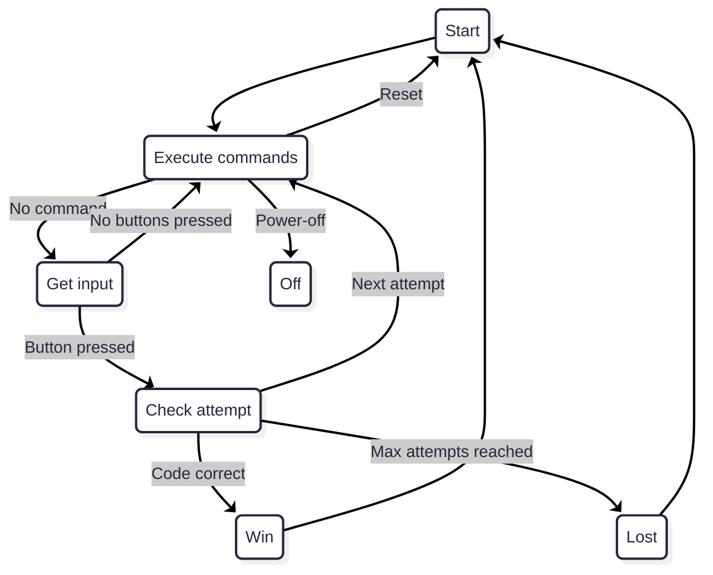

En rejouant à **Mastermind** avec ma sœur cet été, j’ai eu l’idée de créer une **version électronique** du jeu, que l’on pourrait utiliser seul, sans avoir besoin d’un second joueur.

Ce projet a aussi été l’occasion parfaite d’explorer de nouveaux domaines :
- Écrire du code embarqué en **C++** plutôt qu’en **C**
- Expérimenter avec la carte de développement **nRF52DK** de Nordic Semiconductor
- Apprendre à utiliser **Zephyr RTOS** via le nRF Connect SDK
- Utiliser le **Bluetooth Low Energy (BLE)** pour connecter le dispositif à une application mobile Flutter, permettant de configurer la partie et de consulter les essais précédents

## Les règles du Mastermind

Pour ceux qui ne le connaissent pas, **Mastermind** est un jeu de logique à deux joueurs. L’un choisit secrètement une combinaison de pions colorés, tandis que l’autre doit deviner la séquence exacte en un nombre limité d’essais. Après chaque tentative, le premier joueur fournit des indices : une pointe noire indique qu’une couleur est correcte et bien placée, tandis qu’une pointe blanche signifie qu’une couleur est correcte mais mal positionnée.

{: w="300"}
_Mastermind_

Dans ce projet, j’ai implémenté une version simplifiée avec un code de quatre couleurs choisies parmi six possibles. Le joueur doit deviner la bonne séquence, et après chaque tentative, des LEDs d’indication affichent combien de couleurs sont bien placées et combien sont correctes mais mal positionnées.

## Hardware

### nRF52

La **nRF52DK** (basée sur le **nRF52832**) patientait sur mon bureau depuis des mois en attendant un bon projet.
Nordic est bien connu pour ses microcontrolleurs BLE, et cette carte est idéale pour expérimenter avec une applications basées sur **Zephyr**.

{: w="300"}
_Kit de développement nRF52DK_

La carte dispose de LEDs, de boutons, et de nombreuses broches GPIO accessibles, parfaites pour le prototypage avant de passer à un PCB personnalisé.
La programmation et le débogage se font via le **Segger J-Link** intégré, rendant le flashage et le suivi série très simples.

### Bande LED

Pour afficher à la fois le code de **4 couleurs** et les **4 indices**, il faut 8 LEDs RGB.
Pour simplifier le câblage, j’ai réutilisé une **bande LED WS281B** issue de mon précédent **projet Ambilight**.

> Pour en savoir plus sur mon projet **Ambilight**, vous pouvez le consulter [ici]().
{: .prompt-tip }

{: w="150"}
_Bande LED avec contrôleur WS281B_

Le WS281B utilise un **one-wire protocole**, où les données sont transmises selon une séquence de signaux haut/bas très précise. Chaque LED lit la partie du signal qui lui est destinée et transmet le reste à la suivante, ce qui permet de tout piloter avec une seule broche GPIO.

Pour l’intégration, la bande a été coupée en **deux groupes de quatre LEDs** (code + indices), mais reliée sur la même ligne de données. Des broches ont été soudées directement sur les pastilles pour la connexion au microcontrôleur.

### Boutons

Pour saisir les couleurs, j’ai choisi d'utiliser un bouton par couleur plutôt qu’un seul bouton rotatif.
Cette approche rend le jeu beaucoup plus intuitif et offre un retour visuel immédiat.

Chaque bouton correspond à l’une des six couleurs disponibles.

{: w="150"}
_Boutons colorés_

### Afficheur 7 segments

Un afficheur **double 7 segments** sert à afficher le nombre d’essais effectués.
Cela permet de suivre facilement la progression de la partie.

{: w="100"}
_Afficheur double 7 segments_

L’afficheur est piloté par un **registre à décalage 74HC595**, qui réduit le nombre de GPIO utilisées en gérant les segments via une interface série (SPI). Cela facilite également la mise en cascade d’autres afficheurs si nécessaire.

### Buzzer piézoélectrique

Un petit **buzzer passif** ajoute des effets sonores pour les actions du joueur : appuis sur les boutons, validation des essais ou fin de partie.
Il est piloté par un signal PWM pour générer de simples tonalités directement depuis le microcontrôleur.

## Software

> Le code source complet du projet est disponible sur GitHub: [https://github.com/nicopaulb/mastermind](https://github.com/nicopaulb/mastermind)
{: .prompt-info }

### Zephyr

[Zephyr](https://zephyrproject.org/) est un **système d’exploitation temps réel (RTOS)** open source destiné aux systèmes embarqués.

{: w="100" h="100"}
_Zephyr_

Son principale avantage réside dans son abstraction matérielle : grâce à **Devicetree** et **KConfig**, il permet de décrire le matériel et de configurer les fonctionnalités sans modifier le code source.

#### Devicetree

Le projet inclut des fichiers **Devicetree overlay** pour :
- La carte **nRF52DK** (pour le développement)
- Le **nRF52840** (pour le prototype final sur PCB)

Ainsi, le même firmware peut être compilé pour les deux cibles sans toucher au code principal.

Ci-dessous un extrait de l'overlay Devicetree pour nRF52840, qui décrit la configuration de la bande LED :

```conf
&spi2 {
	compatible = "nordic,nrf-spim";
	pinctrl-0 = <&spi2_ledstrip>;
	pinctrl-1 = <&spi2_ledstrip_sleep>;

	led_strip: ws2812@0 {
		compatible = "worldsemi,ws2812-spi";

		/* SPI */
		reg = <0>;
		spi-max-frequency = <4000000>;

		/* WS2812 */
		chain-length = <8>;
		color-mapping = <LED_COLOR_ID_GREEN
		LED_COLOR_ID_RED
		LED_COLOR_ID_BLUE>;
		spi-one-frame = <0x70>;
		spi-zero-frame = <0x40>;
	};
};

...

&pinctrl {

  ...

	spi2_ledstrip: spi2_ledstrip {
		group1 {
			psels = <NRF_PSEL(SPIM_SCK, 1, 1)>,
			        <NRF_PSEL(SPIM_MOSI, 1, 0)>,
			        <NRF_PSEL(SPIM_MISO, 1, 7)>;
		};
	};

	spi2_ledstrip_sleep: spi2_ledstrip_sleep {
		group1 {
			psels = <NRF_PSEL(SPIM_SCK, 1, 1)>,
			        <NRF_PSEL(SPIM_MOSI, 1, 0)>,
			        <NRF_PSEL(SPIM_MISO, 1, 7)>;
			low-power-enable;
		};
	};
};
```
{: file="boards/promicro_nrf52840_nrf52840_uf2.overlay" }

La première section ajoute la bande LED au nœud `spi2`, en définissant divers paramètres tels que la fréquence SPI maximale et le nombre de LEDs dans la bande.

La seconde section définit de nouveaux nœuds enfants `pinctrl`, précisant quelles broches physiques sont attribuées à `spi2` pour le fonctionnement normal et pour le mode basse consommation.

#### KConfig

Pour pouvoir tirer parti des différentes fonctionnalités offertes par **Zephyr**, celles-ci doivent d’abord être activées via **KConfig**.
Ce système de configuration contrôle quels modules, pilotes et sous-systèmes sont inclus lors de la compilation du firmware.
En n’activant que les fonctionnalités nécessaires, il garantit que l’image finale reste légère et optimisée, sans code ni ressources inutiles.

```ini
# Device
CONFIG_LOG=y
CONFIG_TEST_RANDOM_GENERATOR=y
CONFIG_ENTROPY_GENERATOR=y
CONFIG_STATIC_INIT_GNU=y
CONFIG_POLL=y
CONFIG_SMF=y
CONFIG_POWEROFF=y
CONFIG_SPI=y

# For LED
CONFIG_LED_STRIP=y
CONFIG_LED_STRIP_LOG_LEVEL_DBG=y

# For Bluetooth
CONFIG_BT=y
CONFIG_BT_SMP=y
CONFIG_BT_PERIPHERAL=y
CONFIG_BT_DIS=y
CONFIG_BT_DIS_PNP=n
CONFIG_BT_DEVICE_NAME="Mastermind"
CONFIG_BT_GATT_CLIENT=y
CONFIG_BT_BUF_ACL_RX_SIZE=251
CONFIG_BT_BUF_ACL_TX_SIZE=251
CONFIG_BT_L2CAP_TX_MTU=247
CONFIG_BT_CTLR_DATA_LENGTH_MAX=251

# For Buzzer
CONFIG_PWM=y
CONFIG_PWM_LOG_LEVEL_DBG=y

# For 7 segment display
CONFIG_AUXDISPLAY=y
CONFIG_AUXDISPLAY_74HC595=y
```
{: file="prj.conf" }

### nRF Connect SDK

Le **nRF Connect SDK** de Nordic est construit au-dessus de Zephyr et fournit de nombreux pilotes **BLE, GPIO, PWM et I2C**.
Cela m’a permis de me concentrer sur la logique applicative plutôt que sur le développement de pilotes bas niveau.

L’installation se fait directement via une extension VS Code, depuis laquelle on peut installer et gérer le SDK, la toolchain et les projets. Cette interface rend la compilation, le flashage et le débogage particulièrement simples et intégrés.

### C++ pour le développement embarqué

Contrairement à la plupart de mes projets précédents en **C**, celui-ci est écrit principalement en **C++**.
L’objectif était d’utiliser des abstractions modernes tout en respectant les contraintes de l’embarqué : pas d’allocation dynamique, comportement déterministe, faible empreinte mémoire.

Pour cela, j’ai utilisé la **Embedded Template Library (ETL)**, une alternative légère à la STL, offrant des conteneurs et algorithmes à capacité fixe conçus pour les microcontrôleurs.

### Architecture

La logique principale de l’application est organisée autour de l’**API de machine à états finis (FSM)** de Zephyr, qui offre une manière claire et modulaire de gérer les différents états et transitions du jeu Mastermind.

Chaque état correspond à une phase distincte du jeu : gestion des entrées du joueur, vérification des propositions, traitement des commandes BLE, ou encore gestion de l’alimentation et des réinitialisations.

Cette architecture garantit une claire séparation des responsabilités, rendant le code plus lisible, facile à étendre et simple à maintenir.


<p style="color:#6d6c6c;font-size: 80%;text-align:center;">State diagram</p>

### Implémentation

Chaque périphérique (boutons, bande LED, afficheur 7 segments et BLE) est implémenté dans une paire de fichiers **C++ source et header** distincte.

Cette structure modulaire améliore la lisibilité et la maintenabilité, en isolant la **logique matérielle** du flux principal de l’application.

#### Gestion des entrées

Chaque bouton est configuré pour déclencher une **interruption GPIO** lors d’un appui, ce qui génère un **signal** traité par le thread principal de l’application.
Celui-ci appelle la fonction `button_val wait_for_input(k_timeout_t timeout)` pour attendre une entrée de l'utilisateur.
Cette fonction reste bloquée jusqu’à la réception d’un signal ou jusqu’à l’expiration du délai spécifié.

```c++
/**
 * @brief Wait for a button press event with a given timeout.
 *
 * @param timeout The timeout in milliseconds.
 * @return The button value of the pressed button, or BUTTON_VAL_NONE if no event was received.
 */
button_val buttons::wait_for_input(k_timeout_t timeout)
{
	unsigned int signaled;
	int result;
	int index = 0;
	button_val ret = button_val::BUTTON_VAL_NONE;
	struct k_poll_event events[1] = {
		K_POLL_EVENT_INITIALIZER(K_POLL_TYPE_SIGNAL,
								 K_POLL_MODE_NOTIFY_ONLY,
								 &signal),
	};

	k_poll(events, 1, timeout);
	k_poll_signal_check(&signal, &signaled, &result);

	if (signaled)
	{
		for (const auto &i : specs)
		{
			if (BIT(i.pin) == result)
			{
				ret = static_cast<button_val>(index);
				break;
			}
			index++;
		}
	}
	else
	{
		ret = button_val::BUTTON_VAL_NONE;
	}

	k_poll_signal_reset(&signal);
	events[0].state = K_POLL_STATE_NOT_READY;
	return ret;
}
```
{: file="src/buttons.cpp" }

En fonction du bouton pressé, le tableau représentant l'essai actuel est mis à jour, et les LED correspondantes sont rafraîchies pour afficher visuellement le nouvel état.

Tous les boutons partagent un mécanisme de debounce commun, qui filtre le bruit et garantit qu’un seul événement est pris en compte par pression.
De plus, un temps minimal entre deux appuis est imposé pour éviter les pressions multiples involontaires ou simultanées.

#### Pilote de la bande LED

Pour contrôler la bande LED, j’ai utilisé un pilote Zephyr existant compatible avec le contrôleur WS281B.
Ce pilote gère automatiquement le protocole de synchronisation précis requis par les LED.

Il fournit notamment la fonction `led_strip_update_rgb()`, qui permet de mettre à jour facilement l’ensemble de la bande en transmettant un tableau de valeurs RVB.
Cela rend la mise à jour des LED très simple tout en garantissant une gestion facile des couleurs.

#### Afficheur 7 segments

J’ai développé un **pilote Zephyr** pour l’afficheur 7 segments basé sur un **registre à décalage 74HC595**.

Ce pilote implémente l’**API AuxDisplay** de Zephyr, ce qui permet d’afficher un nombre via un simple appel de fonction, par exemple `auxdisplay_write("10")`.

C’est la seule partie du projet écrite en **C** plutôt qu’en **C++**, car j’aimerais à terme soumettre ce pilote au catalogue officiel de Zephyr sur GitHub.

#### Buzzer PWM

Le buzzer est contrôlé à l’aide du **pilote PWM** de Zephyr, qui permet de générer des sons précis en faisant varier la fréquence et la durée des signaux.
Chaque effet sonore (navigation dans le menu, sélection de couleur, fin de partie, etc.) est défini comme une courte séquence de notes.

Un thread dédié, créé via le **Thread API** de Zephyr, gère la lecture des mélodies en ajustant dynamiquement la fréquence du PWM, ce qui permet de jouer des sons complets sans bloquer l’exécution principale de l’application.

Ci-dessous l'implementation de ce thread:

```c++
/**
 * @brief Thread function for buzzer.
 *
 * This function is responsible for playing all the notes.
 */
void buzzer::thread(void *object, void *d1, void *d2)
{
    buzzer *buzzer_obj = reinterpret_cast<buzzer *>(object);
    bool restart_now = false;
    k_sem_take(&buzzer_obj->initialized, K_FOREVER);

    while (1)
    {
        restart_now = false;
        for (auto elem : buzzer_obj->song)
        {
            if (elem.note == 0)
            {
                // Silence
                pwm_set_pulse_dt(&buzzer_obj->pwm_buzzer, 0);
            }
            else
            {
                pwm_set_dt(&buzzer_obj->pwm_buzzer, PWM_HZ(elem.note),
                           PWM_HZ((elem.note)) / 2);
            }
            if (k_msleep(elem.duration) > 0)
            {
                // If sleep is interrupted by another song request, immediatly stop the current song and restart the new one
                restart_now = true;
                break;
            };
        }

        pwm_set_pulse_dt(&buzzer_obj->pwm_buzzer, 0);
        if (!restart_now)
        {
            k_sleep(K_FOREVER);
        }
    }
}
```
{: file="src/ble.cpp" }

#### Communication BLE

Le module BLE expose un **profil GATT personnalisé** permettant à la fois de partager l’état du jeu et de configurer l’appareil.

{: w="500" h="500" }
_Profil BLE_

Au cœur de ce système se trouve le **service Status**, qui transmet toutes les informations essentielles relatives à l’état actuel du jeu.
Les données sont envoyées sous forme d’une chaîne d’octets, contenant successivement le code secret, le nombre d’essais effectués, ainsi que la liste des tentatives précédentes.

Le second service, appelé **service Command**, permet d’envoyer des instructions spécifiques à l'appareil.
Chaque commande est représentée par un identifiant unique, que le firmware interprète pour exécuter l’action correspondante.

Les commandes prises en charge sont :
- 0x00 — **Redémarrer la partie** : réinitialise la session actuelle et lance une nouvelle manche.
- 0x01 — **Définir un code personnalisé** : envoie un code choisi manuellement à l’appareil, remplaçant celui généré aléatoirement.
- 0x02 — **Éteindre l’appareil** : met le système hors tension pour économiser l’énergie. Un appui sur un des boutons physiques permet de le rallumer.

### Application Flutter

Une **application Flutter** simple a été développée afin de se connecter au jeu via **Bluetooth Low Energy (BLE)**.

L’application exploite l’ensemble des données disponibles dans le **service GATT** pour afficher l’état de la partie, les tentatives précédentes et le code secret (lorsqu’il est révélé).
Elle permet également d’envoyer les commandes listées dans la partie précédentes.

J’ai choisi le **framework Flutter** car j’avais déjà une certaine expérience avec cet outil grâce à des projets précédents, notamment **Gazette**.

> Pour en savoir plus sur mon projet **Gazette**, vous pouvez lire l’article complet [ici]().
{: .prompt-tip }

Afin de gérer le BLE avec une API unique et multiplateforme (mobile, bureau et web), j’ai utilisé la bibliothèque [**flutter_blue_plus**](https://pub.dev/packages/flutter_blue_plus).

L’application agit comme un client BLE central, se connectant au périphérique BLE (la carte nRF) et découvrant ses services.
Elle se compose de deux écrans principaux :
- Le premier sert à rechercher et sélectionner un appareil à proximité.
- Le second, une fois la connexion établie, affiche toutes les informations du jeu et permet d’envoyer des commandes à la carte.

{: w="600" h="600"}
_Écrans de l'application_

Pendant la partie, le joueur peut s’appuyer sur l’historique des tentatives affiché à l’écran pour améliorer sa prochaine proposition.

Comme on le voit sur l’image ci-dessus, plusieurs boutons permettent d’envoyer des commandes à la carte.
Par exemple, le bouton “Set code” ouvre une fenêtre contextuelle où l’utilisateur peut choisir les couleur du code en appuyant simplement dessus.

{: w="300" h="600"}
_Fenêtre “Set code”_

Si le joueur souhaite abandonner ou obtenir un indice, il peut révéler la solution en appuyant sur le bouton “Show code”.

Enfin, lorsqu’un joueur trouve le bon code ou perd après avoir utilisé toutes ses tentatives, une fenêtre de fin de partie s’affiche avec le message de victoire ou de défaite, ainsi que le code correct.

{: w="300" h="600"}
_Popup de victoire_

> Le code source complet de l’application Flutter est disponible sur GitHub: [https://github.com/nicopaulb/mastermind/tree/master/flutter-app](https://github.com/nicopaulb/mastermind/tree/master/flutter-app).
{: .prompt-tip }

## Intégration

Pour la version finale, j’ai choisi d’utiliser une carte basée sur le **nRF52840** à la place du **nRF52832** de la carte de développement.
Ce choix s’explique principalement par la disponibilité de cartes clones bon marché, déjà équipées d’un connecteur USB-C, d’une horloge externe, et d’un bootloader préinstallé.

Grâce à ce bootloader, le microcontrôleur peut être programmé facilement : il suffit de le passer en mode bootloader, de le connecter à un ordinateur, puis de glisser le fichier UF2 dans le volume USB monté.
La programmation est également possible via un débogueur **ST-Link V2** en utilisant les broches **SWD/SWCLK**, mais j’ai choisi de ne pas les router sur le PCB afin de gagner de la place.

{: w="600" h="600"}
_Prototype sur breadboard_

Le premier prorotype a été fait avec une breadboard et beaucoup de fils mais j'ai ensuite utilisé **KiCad** pour dessiner le schémas et PCB.

### Schéma

{: w="600" h="600"}
_Schema_

Le module nRF52840 intègre également un chargeur de batterie, j’ai ajouté un connecteur JST à 2 broches pour pouvoir brancher directement une batterie Li-Ion ou Li-Po, rendant ainsi le jeu entièrement portable.

J’ai également ajouté un bouton supplémentaire connecté à la broche de réinitialisation du nRF52840, afin de faciliter la remise à zéro du système ou l’accès au mode bootloader lors de la programmation.

### PCB

{: w="600" h="600"}
_PCB Layout_

Le PCB double couche a également été conçu avec **KiCad**.
Les pistes ont été soigneusement routées pour éviter les interférences, notamment sur les signaux du bus SPI et I²C.
Une fois le design validé, j’ai fait fabriquer la carte par **JLCPCB** mais l'assemblage s’est fait à la main : soudure des connecteurs, de l’écran, du buzzer, des LEDs et des boutons.

{: w="600" h="600"}
_PCB non soudé_

{: w="600" h="600"}
_PCB final assemblé_

J’ai également ajouté quelques trous de fixation dans les coins afin de pouvoir éventuellement fixer la carte dans un boîtier imprimé en 3D.

## Demo

